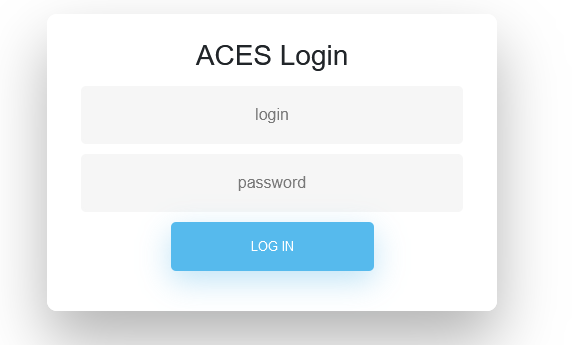
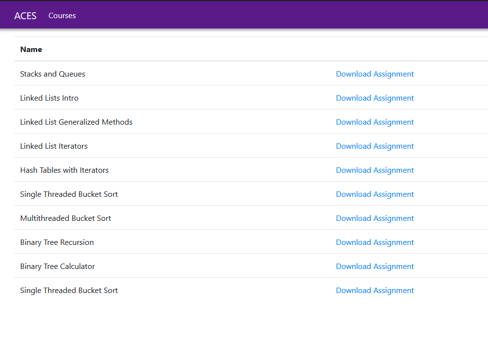

## A.C.E.S. Dashboard

### Login

The login page accepts an email or username, and a password. It then checks against the students and instructors in the database to see if a matching login exists. If it does, it will hash the entered password and compare it against the stored password for that user to see if it is correct. If everything checks out, the user will be taken to the *Courses* page.

### Courses 

The courses page filters based on the courses assigned to the instructor or the student in the database. Clicking on the *Assignments* page takes you to the assignments available in each course.

### Assignments 

The assignments page shows the assignments for the selected course. Clicking on the *Download Assignment* button will download a copy of the assignment (not yet implemented). # How to Run the ACES Dashboard:

### How to Run the ACES Dashboard:
#### Step 1: Install Necessary Software
 - Install Docker
 - Install Git
 - Install Visual Studio or Visual Studio Code

#### Step 2: Clone the Repository from GitHub
 - Clone the repo from GitHub

#### Step 3: Create Docker Containers
 - Navigate to ACES/aces
 - Start docker containers by running `docker-compose up -d`
 - To stop it run `docker-compose down`
 - Large changes require you to stop and then run again (up and down)
 - Larger changes require that you totally clean the images, volumes, etc. that Docker has created for this      project. To do so, run `docker system prune -a`

If you're wishing to run the Dashboard (UI for instructors and students) continue through the following step.

#### Step 4: Restore NuGet Packages
 - From Visual Studio, right click on the project and select "Restore NuGet Packages"

Go ahead and run the project in debug mode.
