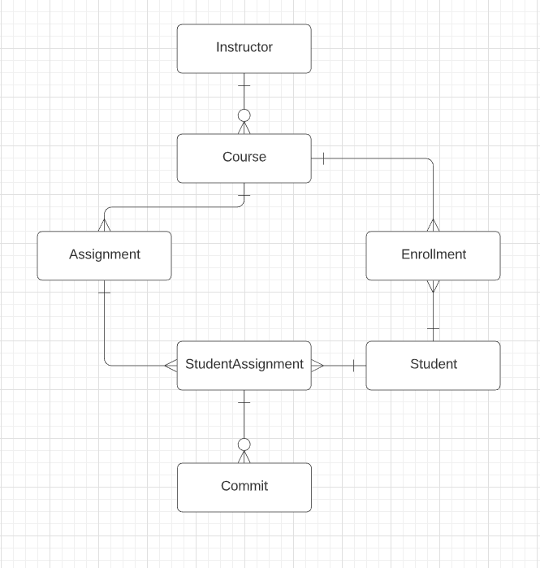

# ACES Database
### Files Overview:
**ACES_DB.bak** - This backup file contains all of the databases schema and data. It is referenced in restore.sql

**Dockerfile** - This files orchestrates all the magic done by “docker-compose”

**restore.sql** - This is run by the Cockerfile to restore from ACES_DB.bak in our database docker container

**Restore_ACES_DB.sql** - This contains all the scripts necessary to create and seed the database in case the current backup technique with Docker stops working

### Making Changes:
When the need arises to make a change to the database schema, you can [restore the database to your local machine](https://docs.microsoft.com/en-us/sql/relational-databases/backup-restore/quickstart-backup-restore-database?view=sql-server-ver15#:~:text=STATS%20%3D%2010%20GO-,Restore%20a%20backup,to%20locate%20your%20backup%20file.) using the ACES_DB.bak file. Make the necessary changes locally using SSMS then [create a backup file](https://support.solarwinds.com/SuccessCenter/s/article/Back-up-and-restore-SQL-database-instance-using-a-BAK-file?language=en_US) with the same name to replace the file in the ACES/aces/database directory. You will then need to `docker-compose down` to close all containers and `docker system prune -a` to reset any references to the old backup file. Then simply run `docker-compose up -d` and you're database changes will be good to go.

### Schema
**Assignment:**
Id : int
Name : nvarchar(100)
RepositoryUrl : nvarchar(MAX)
AssignmentCode : int
CourseId : int (FK)
PointsPossible : int (Compared with PointsEarned in Submission to calculate grade.)

**Course:**
	Id : int
	CourseName : nvarchar(100)
	InstructorId : int (FK)

**Student:**
	Id : int
	FirstName : nvarchar(100)
LastName : nvarchar(100)
	Email : nvarchar(MAX)
	Password : nvarchar(MAX)
	Salt : nvarchar(MAX)

**Instructor:**
	Id : int 
FirstName : nvarchar(100)
	LastName : nvarchar(100)
	Email : nvarchar(MAX)
	Password : nvarchar(MAX)
	Salt : nvarchar(MAX)

**Enrollment:**
	Id : int
	StudentId : int (FK)
	CourseId : int (FK)
	Active : boolean (If an enrollment is inactive, that means the student is from a past semester)

**StudentAssignment:**
Id : int
	StudentId : int (FK)
	AssignmentId : int (FK)
	Watermark : nvarchar(MAX)
	RepositoryUrl : nvarchar(MAX)	
	NumWatermarks : int (This represents the number of watermarks a students personal assignment should have. It is compared with Commit.NumWatermarks to see if they have tampered with the code.)
		
**Commit:**
	Id : int 
	StudentAssignmentId : int (FK)
	PointsEarned : int (Compared with PointsPossible in Assignment to calculate grade.)
	DateCommitted : datetime
	LinesAdded : int
LinesDeleted : int
NumWatermarks : int (Compared with StudentAssignment.NumWatermarks to see if they have been tampered with.)

